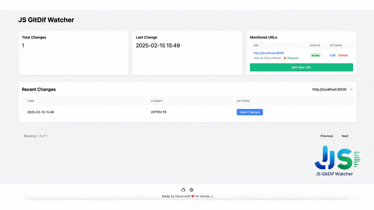

# JS GitDif Watcher 🕵️‍♂️ V.1.0.0



A powerful JavaScript monitoring tool for bug bounty hunters. Track changes in JavaScript files across websites, detect new attack surfaces, and stay ahead of security vulnerabilities.

## 🎯 Features

- 🔍 Monitor JavaScript files from any website
- 📊 Git-based version control of changes
- 🌐 Clean web UI for easy configuration
- 🔔 Telegram notifications for instant alerts
- ⚡ Configurable monitoring intervals
- 🔄 Automatic retry and timeout mechanisms
- 📝 Efficient diff viewing for quick analysis


## 🚀 Quick Start

### Installation

```bash
go install github.com/mirzaaghazadeh/jsdif@1.0.0
```

### Usage

```bash
jsdif run -p 9093
```

That's it! Access the web interface at `http://localhost:9093` to start monitoring your targets.

## 🔥 Bug Bounty Use Cases

- 🎯 Track new JavaScript endpoints and APIs
- 🔑 Monitor for leaked sensitive information
- 🛡️ Detect changes in security controls
- 🚀 Find new features before they're officially released
- ⚠️ Identify removed security checks
- 📦 Track third-party script changes
- 🔒 Monitor authentication/authorization changes


## 🔨 Building from Source

```bash
git clone https://github.com/mirzaaghazadeh/jsdif.git
cd JS-GitDif-Watcher
go build -o jsdif
```


## 📝 License

This project is open source. Feel free to use and contribute!

---

**⚠️ Note:** This tool is intended for bug bounty hunting and security research. Use responsibly and follow program policies.
